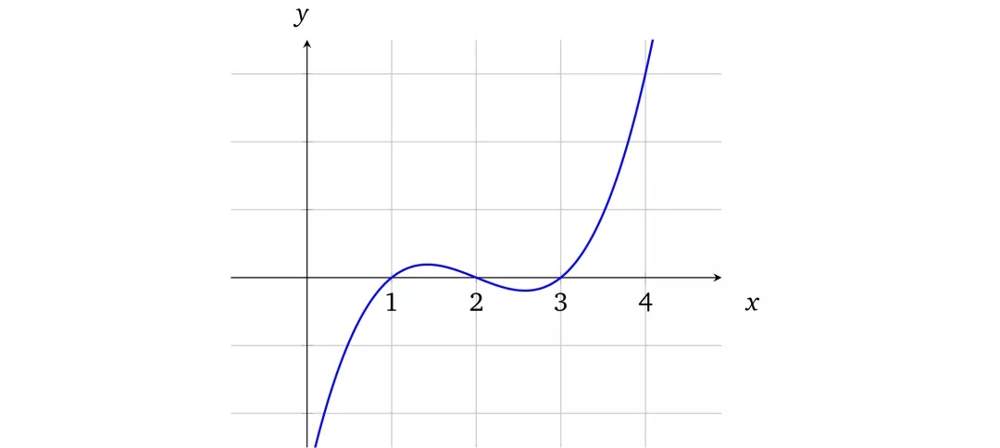
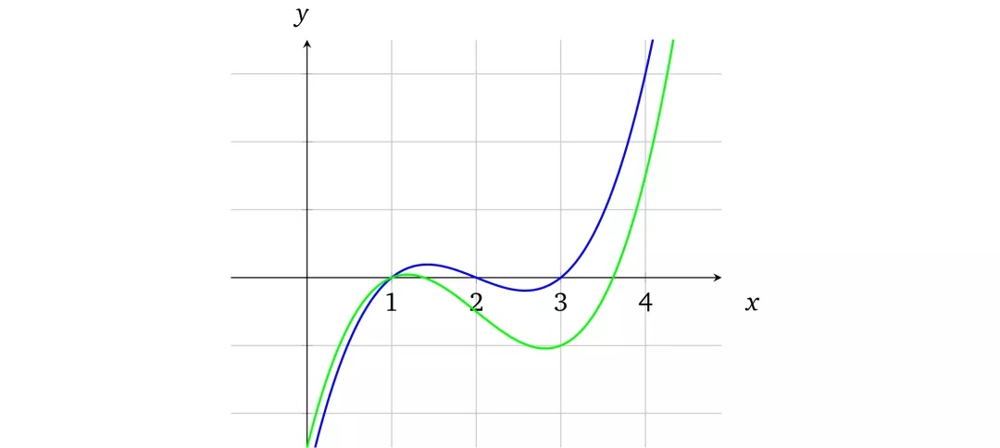
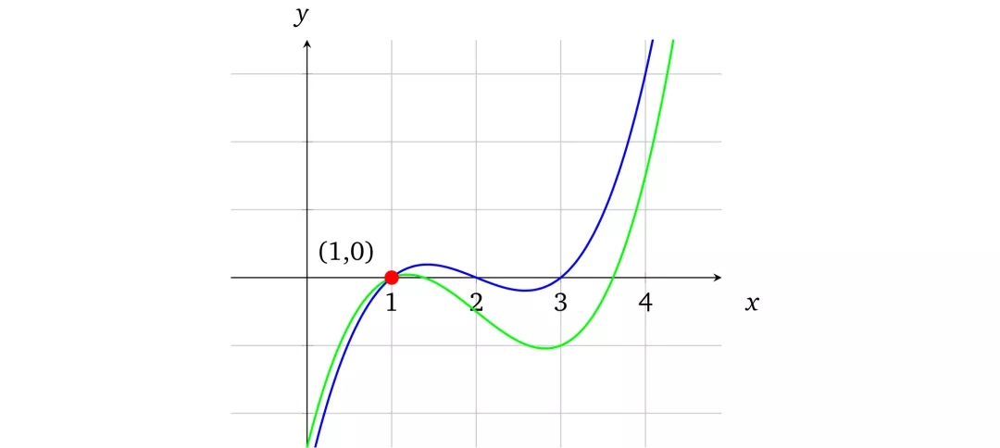

从零开始学习zk-SNARK(一)-多项式的性质与证明

zk-SNARK

偶然一次机会，看到了 Maksym Petkus 的这篇文章。文章从最基本的多项式性质讲起，从一个简单易懂的证明协议开始，然后像堆积木一样在发现问题，修改问题中逐步去完善协议，直到最终构造出完整的 zk-SNARK 协议。于是想把它翻译出来（已获得作者授权），一方面加深自己的学习，另一方面也将这份宝藏分享给小伙伴们。 
> 17 年最早接触 zk-SNARK 开始，就断断续续得学习了一些 zk-SNARK 的知识，但对其原理始终存在诸多困惑，没有形成一个完整的认识。偶然一次机会，看到了 Maksym Petkus 的这篇文章。文章从最基本的多项式性质讲起，从一个简单易懂的证明协议开始，然后像堆积木一样在发现问题，修改问题中逐步去完善协议，直到最终构造出完整的 zk-SNARK 协议。另外作者这种从问题出发的讲解方式，让读者知其然，也知其所以然 。作为一枚毕业多年早把数学知识还给老师的程序媛，读到这篇文章如获至宝，这篇文章读下来的感受像找到了一个脚手架，将脑海里碎片化的知识逐渐拼凑完整。于是想把它翻译出来（已获得作者授权），一方面加深自己的学习，另一方面也将这份宝藏分享给小伙伴们。

【本系列文章】

1. [多项式的性质与证明](https://learnblockchain.cn/article/287)

2. [多项式的非交互式零知识证明](https://learnblockchain.cn/article/329)

3. [从程序到多项式的构造](https://learnblockchain.cn/article/393)

4. [多项式的约束](https://learnblockchain.cn/article/394)

5. [Pinocchio 协议](https://learnblockchain.cn/article/493)

## Maksym（作者）：

不管是原始的论文[[Bit+11](#reference)];[[Par+13](#reference)]还是原理讲解[[Rei16](#reference)];[[But16](#reference)]; [[But17](#reference)];[[Gab17](#reference)]，其实市面上已经有大量关于 zk-SNARK 的学习资源了 。zk-SNARK 由大量的可变模块组成，所以对很多人来说它依然像一个黑盒子一样很难懂。这些资料对 zk-SNARK 中的一些技术难题部分做出了解释，但由于缺少了对应的其它环节的解释，大家还是很难通过这些资料了解到 zk-SNARK 的全貌。

当我第一次了解到 zk-SNARK 技术是如何将这些东西完美地融合在一起的时候，就被数学之美震撼到了，并且随着我发现的维度越多，好奇心就越强烈。在这篇文章中，我主要就基于一些实例简洁明了地阐明 zk-SNARK ，并对这里面的很多问题做出了解释，并利用这种方式分享了我的经验，进而让更多人也能够欣赏到这项最先进的技术以及它的创新之处，最终欣赏到数学之美。

这篇文章的主要贡献是比较简洁明了的解释了其中相当复杂的技术，这些简单的解释对于在不具备任何与之相关的先决知识，比如密码学和高等数学，的前提下理解 zk-SNARK 是很有必要的。文章中并不仅仅只解释 zk-SNARK 是如何工作的，还解释了为什么这样就可以工作，以及它是怎么来的。

-------

## 序言和介绍

尽管最初计划写短一些，但现在已经写了几十页了，不过这篇文章读起来几乎不需要什么预备知识，并且你也可以随意跳过熟悉的部分。如果你不熟悉文中使用的某些数学符号也不需要担心，文中将会对这些符号逐个进行介绍。

*Zero-knowledge succinct non-interactive arguments of knowledge (zk-SNARK)* 确实是一种非常精妙的方法，它可以在不揭示任何信息的前提下证明某个论断为真。但首要问题是，它为什么有用？

其实零知识证明在无数的应用中都具备优势，包括：

1. 证明关于隐私数据的声明：

    * 一个人 A 的银行账户金额多于 X

    * 去年，一家银行未与实体 Y 进行交易

    * 在不暴露全部 DNA 数据的前提下匹配 DNA

    * 一个人的信用评分高于 Z

    

2. 匿名认证：

    * 在不揭露身份的情况下（比如登录密码），证明请求者 R 有权访问网站的受限区域

    * 证明一个人来自一组被允许的国家/地区列表中的某个国家/地区，但不暴露具体是哪个

    * 证明一个人持有地铁月票，而不透露卡号

3. 匿名支付：

    * 付款完全脱离任何一种身份

    * 纳税而不透露收入

4. 外包计算

    * 将昂贵的计算外包，并在不重新执行的情况下验证结果是否正确；它打开了一种零信任计算的类别

    * 改进区块链模型，从所有节点做同样的计算，到只需一方计算然后其它节点进行验证

和「零知识证明」这个伟大的名词一样，其背后的方法可以说是数学和密码学的奇迹。自1985 年，零知识证明这个概念在 “交互式证明系统的知识复杂性”[[GMR85](#reference)]一文中被引入，还有随后的非交互式零知识证明[[BFM88](#reference)]以来（在区块链环境中尤其重要），至今已经进入到第四个十年的研究。

在任意的「零知识证明」系统中，都有一个 prover 在不泄漏任何额外信息的前提下要让 *verifier* 确信某些陈述（Statement）是正确的。例如 *verifier* 仅能知道 *prover*的银行账户金额超过 X（也就是不披露实际金额）。协议应当满足下面三个性质：

* 完整性 —— 只要「陈述」是正确的，prover 就可以让 verifier 确信

* 可靠性 —— 如果「陈述」是错误的，那么作弊的 prover 就没有办法让 verifier 相信

* 零知识 —— 协议的交互仅仅揭露「陈述」是否正确而不泄漏任何其它的信息

zk-SNARK 这个术语本身是在 [[Bit+11](#reference)]中引入的，它在[[Gro10](#reference)]的基础上，又遵循了匹诺曹协议[[Gen+12](#reference)]; [[Par+13](#reference)]使其能够适用于通用的计算。

## 证明的媒介

这里我们先不要去管零知识，非交互性，其形式和适用性这些概念，就从尝试证明一些简单的东西开始。

想象一下我们有一个长度为10 的位数组，现在要向 verifier（例如，程序）证明这样一个陈述：所有的位都被设置成了 1。

verifier 一次只能检查（即，读）一位。为了验证这个陈述，我们以某种任意的顺序读取元素并检查其是否确实等于 1 。如果第一次抽样检查的结果是 1，就设置「陈述」的可信度为 ⅒= 10％，否则，如果等于 0，就说明「陈述」是错误的。验证者继续进行下一轮验证，直到获得足够的可信度为止。假如在一些场景下要信任 prover 需要至少 50% 的可信度，那就意味着必须执行 5 次校验。但假如在其它一些场景下需要 95% 的可信度，就需要检查所有的元素。很明显这个证明协议的缺点是必须要根据元素的数量进行检查，如果我们处理数百万个元素的数组，这么做是不现实的。

现在我们来看一下由数学方程式表示的多项式，它可以被画成坐标系上的一条曲线：

上面的曲线对应多项式: $f(x) = x³ - 6x² + 11x - 6$。多项式的阶数取决于 x 的最大指数，当前多项式的阶数是 3。

多项式有一个非常好的特性，就是如果我们有两个阶为 d 的不相等多项式，他们相交的点数不会超过 d。例如，稍微修改一下原来的多项式为 $x³ - 6x² + 10x - 5$ （注：请注意这里只修改了多项式的最后一个系数，6改成了5）并在图上用绿色标出：

这一点微小的修改就产生了变化很大的曲线。事实上，我们不可能找到两条不同的曲线，他们会在某段区域内重合（他们只会相交于一些点）。

这是从找多项式共同点方法中得出的性质。如果要查找两个多项式的交点，就要先令它们相等。例如，要找到多项式与 x 轴的交点（即 $f(x) = 0$），我们就要令 $x³ - 6x² + 11x - 6 = 0$，等式的解就是共同点：$x = 1$ ，$x = 2$ 和 $x = 3$。在上面图中也可以很清晰得看出这些解，也就是图上蓝色曲线和 x 轴相交的地方。

同样，我们也可以令上文中原始的多项式和修改后的多项式相等，找到它们的交点。

 $x³ - 6x² + 11x - 6 =x³ - 6x² + 10x - 5$

 $x - 1=0$

多项式化简后的结果阶数为 1，它有一个很明显的解 x = 1。因而这两个多项式有一个交点。

任意一个由阶数为 d 的多项式组成的等式，最后都会被化简为另外一个阶数至多为 d 的多项式，这是因为等式中没有能够用来构造更高阶数的乘法。例如：$5x³ + 7x² - x + 2 = 3x³ - x² + 2x - 5$，简化为 $2x³ + 8x² - 3x + 7 = 0$。另外代数的基本原理也告诉我们，对于一个阶数为 d 的多项式至多有 d 个解（以下部分将对此进行详细介绍），因而也就至多有d 个共同点。

所以我们可以得出结论，任何多项式在任意点的计算结果（更多关于多项式求值的参考:[[Pik13](#reference)]）都可以看做是其唯一身份的表示。我们来计算一下当 x = 10 时，示例多项式的结果。

$x³ - 6x² + 11x - 6 = 504$

$x³ - 6x² + 10x - 5 = 495$

事实上，在 x 可以选择的所有值中，至多只有三个值能够使这些多项式相等，其它的值都是不相等的。

这也是为什么如果一个 prover 声称他知道一些 verifier 也知道的多项式（无论多项式的阶数有多大）时，他们就可以按照一个简单的协议去验证：

* verifier 选择一个随机值 x 并在本地计算多项式结果

* verifier 将 x 值给到 prover，并让他计算相关的多项式结果

* prover 代入 x 到多项式计算并将结果给到 verifier

* verifier 检查本地的计算结果和 prover 的计算结果是否相等，如果相等那就说明 prover 的陈述具有较高的可信度

例如，我们把 x 的取值范围定在 1 到 10⁷⁷,  那么计算结果不同的点的数量，就有 10⁷⁷ – d 个。因而 x 偶然“撞到”这 d 个结果相同的点中任意一个的概率就等于（可以认为是几乎不可能）：

> @Maksym（作者）
与低效的位检查协议相比，新的协议只需要一轮验证就可以让陈述具有非常高的可信度（假设 d 远小于 x 取值范围的上限，就几乎是 100%了）

这也是为什么即使可能存在其他的证明媒介，**多项式依然是 zk-SNARK 相对核心的部分。**

> 注解
even@安比实验室：这一节告诉了我们多项式的一个重要性质：我们不可能找到共享连续段的两条不相等曲线，也就是任何多项式在任意点的计算结果都可以看做是其唯一身份的表示。也就是说只要能证明多项式上的某个随机点就可以证明这个多项式（只有在知道了多项式，才能算出这个点对于的值），这个性质是我们下面所有证明的核心。

这就是 Schwatz-Zippel 定理，它可以扩展到多变量多项式，即在一个多维空间内形成一个曲面。这个定理会在多个零知识证明方案的证明中反复出现。

## 证明多项式的知识

我们的讨论从证明多项式的知识开始，再将证明协议逐步转换成一种通用的方法，在这个过程中我们也将发现多项式的很多其它性质。

但是到目前为止，我们的协议还只是一个很弱的证明，因为协议中并没有采取任何措施去保证参与方必须按照协议的规则生成证明，所以参与方只能互相信任。例如，prover 并不需要知道多项式，也可能通过其它方式得到正确的答案。而且，如果 verifier 要验证的多项式的解的取值范围不够大，比如我们前文说的 10，那个就可以去猜一个数字，猜对答案的概率是不可忽略不计的。因而我们必须要解决协议中的这个缺陷，在解决问题之前首先来想一下，**知道多项式意味着什么呢？**

多项式可以用下面的形式来表示（其中 n 指的是多项式的阶）：

$ c_nx^n+ .. +c_1x^1+c_0x^0 $

如果一个人说他或她知道一个一阶多项式（即：$c_1x^1+c_0=0$），那么这就意味着他或她确实知道 系数 $c_0, c_1$的值。这个系数可以是包括 0 在内的任意值。

假设证明者声称他知道一个包含 x=1 和 x=2 两个解的三阶多项式。满足此条件的一个有效的多项式就是 x³ – 3x²+ 2x= 0。因为x= 1: 1 – 3 + 2 = 0，x= 2: 8 – 12 + 4 = 0。

我们先来仔细得研究一下这个答案的结构。

> 注解
even@安比实验室：这一节告诉了我们多项式的一个本质——多项式的「知识」就是多项式的系数。所谓「知道」多项式就是指「知道」多项式的系数。

## 因式分解

代数的基本定理表明了任意的一个多项式只要它有解，就可以将它分解成线性多项式（即，一个阶数为 1 的多项式代表一条线），因此，我们可以把任意有效的多项式看成是其因式的乘积：

$(x-a_0)(x-a_1) ..(x-a_n)=0$

也就是说如果任意一个因式为 0，那么整个等式都为 0，也就是说式子中所有的 as 就是多项式的所有解。

$x^3 - 3x^2 + 2x =(x-0)(x-1)(x-2)$

所以这个多项式的解（x 的值）就是：0，1，2，在任何形式下多项式的解都可以很轻松的被验证，只不过因式的形式可以让我们一眼就看出这些解（也称为根）。

我们再回到前面的问题， prover 宣称他知道一个阶数为 3，其中两个根分别为 1 和 2 的多项式，也就是说这个多项式的形式为：

(x-1)(x-2) · …

换句话说 (x–1) 和 (x –2) 是问题中多项式的两个因式。因而如果 prover 想要在不揭示多项式的前提下证明他的多项式确实有这两个根，那么他就需要去证明他的多项式 p(x) 是 t(x) = (x- 1)(x- 2) （也称为目标多项式）和一些任意多项式 h(x) （也就是我们的例子里面的 x - 0）的乘积，即：

$p(x) = t(x) · h(x)$

换句话说，存在一些多项式 h(x) 能够使得 t(x) 与之相乘后等于 p(x)，由此得出， p(x) 中包含 t(x)，所以 p(x) 的根中也包含 t(x) 的所有根，这也就是我们要证明的东西。

自然算出 h(x) 的方式就是直接相除：

$ h(x)=\frac{p(x)}{t(x)} $

如果一个 prover 不能找到这样一个 h(x) 也就意味着 p(x) 中不包含因式 t(x)，那么多项式相除就会有余数。例如我们用 p(x) = x³ – 3x² + 2x 除以 t(x) = (x – 1)(x – 2) = x² – 3x+ 2

> 注意：左边的式子是分母，右上角的是计算结果。底部是余数（多项式相除的解释及示例可以看[这里](http://www.mesacc.edu/~scotz47781/mat120/notes/divide_poly/long_division/long_division.html)）

我们算出结果 h(x) = x，没有余数。

注意：为了简化起见，后面我们会用多项式的字母变量来代替计算结果值，例如：p = p(r)。

> 注解
even@安比实验室：多项式可以被因式分解成它的根的因式的乘积。这个性质就意味着，如果一个多项式有某些解，那么它被因式分解后的式子中一定包含这些解的因式。

有了这个性质，我们就可以愉快地去做一些证明啦。

利用**多项式一致性检查协议**我们就可以比较多项式 p(x) 和 t(x) ⋅ h(x)：

* verifier 挑选一个随机值 r, 计算 t = t(r) (即，求值) ，然后将 r 发送给 prover。

* prover 计算 h(x) =p(x) / t(x) ，并对 p(r) 和 h(r) 进行求值，将计算结果 p, h 提供给 verifier。

* verifier 验证 p= t⋅h，如果多项式相等，就意味着 t(x) 是 p(x) 的因式。

实践一下，用下面的例子来执行这个协议：

* verifier 选一个随机数 23，并计算 t = t(23) = (23 – 1)(23 – 2) = 462，然后将 23 发给 prover

* prover 计算 h(x) =p(x) / t(x) = x, 并对 p(r) 和 h(r) 进行求值，p= p(23) = 10626，h= h(23) = 23，将 p 和 h 提供给 verifier

* verifier 再验证 p= t⋅h：10626 = 462 ⋅ 23 是正确的，这样陈述就被证明了。

相反，如果 prover 使用一个不同的 p′(x) ，它并不包含必要的因式，例如 p′(x) = 2x³ – 3x² + 2x, 那么：

> @Maksym（作者）
虽然为了简化而使用了一组数学符号，但是如果忽视这个无处不在的基本符号：’(上撇)的话将不利于理解。这个符号本质目的是为了强调一个经过初始变量变换或者推导得到的新变量。即，如果我们想要将 v 乘以 2 并给将它赋值给一个新的变量，我们可以使用：v'= 2 ⋅ v。

我们算出结果2x + 3 和余数7x – 6，即：p(x) = t(x) × (2x+ 3) + 7x – 6。这就意味着 prover 为了计算出结果他不得不用余数除以t(x)，

$h(x)=2x+3+\frac{7x-6}{t(x)}$ 。

不过由于 x 是 verifier 随机选择的，就有极低的概率余数 7x – 6 最终可以被 t(x) 整除。如果后面 verifier 要另外再检查 p 和 h 必须是整数的话，这个证明才会被拒绝。不过要这么校验就同时要求多项式系数也是整数，这对协议产生了极大的限制。

这就是为什么接下来我们要介绍能够使余数不被整除的密码学原理的原因，尽管这个原始值是有可能被整除的。

**Remark 3.1**现在我们就可以在不知道多项式的前提下根据特定的性质来验证多项式了，这就已经给了我们一些零知识和简明性的特性。但是，这个结构中还存在好多问题：

* prover 可能并不知道他所声称的 p(x)，他可以先算一下  t = t(r)，然后选择一个随机值 h，由此计算出 p = t⋅h。因为等式是成立的，所以也能通过 verifier 的校验。

* 因为 prover 知道随机点 x = r ，他可以构造出一个任意的多项式，这个任意多项式与 t(r) ⋅ h(r) 在 r 处有共同点。

* 在前面的「陈述」中，prover 声称他知道一个特定阶数的多项式，但现在的协议对阶数并没有明确的要求。因而 prover 完全可以拿一个满足因式校验的更高阶数的多项式来欺骗 verifier。

下面我们就要来逐一得解决这些问题。

> 注解
even@安比实验室：利用因式的性质构造出了一个证明协议，但这个协议存在一些缺陷，主要是由于

1. prover 知道了 t(r)，他就可以反过来任意构造一个可以整除 t(r) 的 p(r)

2. prover 知道了点(r,t(r) · h(r)) 的值，就可以构造经过这一点的任意多项式，同样满足校验

3. 协议并没有对 prover 的多项式阶数进行约束

## 模糊计算

Remark 3.1 中的前两个问题是由于 **暴露了原始值** 而导致的，也就是 prover 知道了 r 和 t(r)。但如果 verifier 给出的这个值像放在黑盒里一样不可见的话就完美了，也就是一个人即使不破坏协议，也依然能在这些模糊的值上面完成计算。有点类似哈希函数，从计算结果就很难再回到原始值上。

### 同态加密

这也就是要设计同态加密的原因。它允许加密一个值并在密文上进行算术运算。获取加密的同态性质的方法有多种，我们来介绍一个简单的方法。

总体思路就是我们选择一个基础的（基数需要具有某些特定的属性）的自然数 g（如 5），然后我们以要加密的值为指数对 g 进行求幂。例如，如果我们要对 3 进行加密：

5^3^=125

这里 125 就是 3 对应的密文。如果我们想要对被加密的值乘 2，我们可以以 2 为指数来对这个密文进行计算。

125^2^=15625 = (5^3^)^2^ =5^2×3^ = 5^6^

我们不仅可以用 2 来乘以一个未知的值并保持密文的有效性，还可以通过密文相乘来使两个值相加，例如 3+2：

5^3^ · 5^2^ = 5^3+2^= 5^5^= 3125

同样的，我们还可以通过相除提取加密的数字，例如：5-3

5^5^/5^3^ = 5^5^ · 5^-3^ = 5^5-3^ = 5^2^ =25

不过由于基数 5 是公开的，很容易就可以找到被加密的数字。只要将密文一直除以 5，直到结果为 1，那么做除法的次数也就是被加密值的数。

### 模运算

这里就到了模运算发挥作用的地方了。模运算的思路如下：除了我们所选择的组成有限集合的前 n 个自然数（即，0，1，…，n-1）以外，任何超出此范围的给定整数，我们就将它“缠绕”起来。例如，我们选择前六个数。为了说明这一点，可以把它看做一个有六个单位大小相等刻度的圆；这就是我们所说的范围（通常指的是有限域）。

现在我们看一下数字八应该在哪里。打个比方，我们可以把它看成一条长度为 8 的绳子。

如果我们将绳子固定在圆圈的开头

然后用绳子缠绕圆圈，我们在缠完一圈后还剩下一部分的绳子。

然后我们继续缠绕，这根绳子将在刻度 2 的地方终止。

这就是模运算操作的结果。无论这根绳子多长，它最终都会在圆圈一个刻度处终止。因而模运算结果将保持在一定范围内（例子中是 0 到 5）。长度为 15 的绳子将会在刻度 3 的地方终止，即 6 + 6 + 3 （缠 2 个完整的圈并剩下 3 个单位长的部分）。负数运算类似，唯一不同的地方就是它是沿相反方向缠绕的，如 -8 的取模结果是 4。

我们执行算术运算，结果都将落在这 n 的范围内。现在开始我们将用符号 “mod n” 来表示这个范围内的数。

3 × 5 = 3 mod 6

5 + 2 = 1 mod 6

另外，模运算最重要的性质就是运算顺序无所谓。例如，我们可以先做完所有的操作，然后再取模，或者每操作完一步都去取模。例如  (2 × 4 – 1) × 3 = 3  (mod 6)  就等于：

2 × 4 = 2 mod 6

2 - 1 = 1 mod 6

1 × 3 = 3 mod 6

那么模运算到底有什么用呢？就是如果我们使用模运算，从运算结果再回到原始值并不容易，因为很多不同的组合会产生一个同样的运算结果：

5 × 4 = 2 mod 6

4 × 2 = 2 mod 6

2 × 1 = 1 mod 6

……

没有模运算的话，计算结果的大小会给找出原始值提供一些线索。除非这里既能把信息隐藏起来，又可以保留常见的算术属性。

### 强同态加密

我们再回到同态加密上，使用模运算，例如取模 7，我们可以得到：

*5^1^ = 5(mod 7)*

*5^2^  = 4(mod 7)*

*5^3^ = 6(mod 7)*

……

不同指数下运算得到了同样的结果：

*5^5^ = 3(mod 7)*

*5^11^ = 3(mod 7)*

*5^17^ = 3(mod 7)*

……

这样就很难知道指数是多少了。事实上，如果模取得相当大，从运算结果倒推指数运算就不可行了；现代密码学很大程度上就是基于这个问题的“困难”。

方案中所有的同态性质都在模运算中保留了下来：

encryption: *5^3^ = 6 (mod 7)*

*multiplication: 6^2^ = (5^3^)^2^ = 5^6^= 1 (mod 7)*

*addition: 5^3^ · 5^2^ = 5^5^ = 3(mod 7)*

注意：模相除有点难已经超出范围了。

我们来明确地说明一下加密函数：

$E(v) = g^v (mod n)$

这里 v 就是我们要加密的值。

**Remark 3.2** 这个同态加密模式有一个限制，我们可以把一个加密的值和一个未加密的值相乘，但我们不能将两个加密的值相乘（或者相除），也就是说我们不能对加密值取幂。虽然这些性质第一感觉看起来很不友好，但是这却构成了 zk-SNARK 的基础。这个限制后面将在“加密值乘法”一节中讲到。

> 注解
> even@安比实验室：通过模运算形成的集合被称为「有限域」，而通过计算指数再进行模运算形成的集合构成「循环群」。常见的同态加密方式除了整数幂取模之外，还有椭圆曲线上的倍乘。

### 加密多项式

配合这些工具，我们现在就可以在加密的随机数 x 上做运算并相应地修改零知识 协议了。

我们来看一下如何计算多项式 p(x) = x³ – 3x² + 2x。我们前面明确了，知道一个多项式就是知道它的系数，也就是这个例子中知道：1，-3，2。因为同态加密并不允许再对加密值求幂，所以我们必须要给出 x 的 1 到 3 次幂取加密值：E(x)，E(x²)，E(x³)，那么我们要计算的加密多项式就是：

$E {(x^3)}^1\cdot E {(x^2)}^{-3} \cdot E {(x)}^2 =  {({g^x}^3)}^1 \cdot  {({g^x}^2)}^{-3} \cdot {(g^x)}^2 = g^{1x^3}  \cdot (g^{-3x^2})  \cdot {{g^2}^x} = g^{x^3-3x^2+2x}$

所以通过这些运算，我们就获得了多项式在一些未知数 x 处的加密计算结果。这确实是一个很强大的机制，因为同态的性质，同一个多项式的加密运算在加密空间中始终是相同的。

我们现在就可以更新前面版本的协议了，比如对于阶数为 d 的多项式：

* Verifier

    * 取一个随机数 s ，也就是秘密值

    * 指数 i 取值为 0，1，…，d 时分别计算出 s 的 i 次幂的加密结果，即：$E{(s^i)}=g^{s^i}$

	* 代入 s 计算未加密的目标多项式：$t(s)$

    * 将对 s 的幂的加密值提供给 prover:$E{(s^0)},E{(s^1)},..,E{(s^d)}$

* Prover

    * 计算多项式 h(x) = p(x)/t(x)

	

    * 使用加密值${g^s}^0,{g^s}^1,..,{g^s}^d,$$和系数 $$ c_0,c_1,..,c_n $计算

	

    * 然后同样计算$ E(h(s)) =g^{h(s)}$

	

    * 将结果 $g^p$ 和 $g^h$ 提供给 verifier

* Verifier

    * 最后一步是 verifier 去校验   $p=t(s) \cdot h : $

	  $g^p ={(g^h)}^{t(s)}  =>  g^p=g^{t(s)\cdot h}$

	

注意：因为证明者并不知道跟 s 相关的任何信息，这就使得他很难提出不合法但是能够匹配验证的计算结果。

尽管这个协议中 prover 的灵活性有限，他依然可以在实际不使用 verifier 所提供的加密值进行计算，而是通过其它的方式来伪造证明。例如，如果 prover 声称有一个满足条件的多项式它只使用了 2 个求幂值 s^3 和 s^1，这个在当前协议中是不能验证的。

> 注解
even@安比实验室：利用强同态加密这个工具，构造了一个相对较强的零知识证明协议。但是如上文所述，这里还是存在一些问题—— 无法验证 prover 是否是真的使用了 verifier 提供的值来构造证明的。

大家可以思考一下，如何解决这个问题？以及这个协议还存在哪些缺陷呢？

在下一节中，我们将会继续展开讨论，并展示如何构造一个完备的多项式的零知识证明协议。

*原文链接*

https://arxiv.org/pdf/1906.07221.pdf

[why-and-how-zk-snark-works-1-introduction](https://medium.com/imolfar/why-and-how-zk-snark-works-1-introduction-the-medium-of-a-proof-d946e931160)

[why-and-how-zk-snark-works-2-proving-knowledge-of-a-polynomial](https://medium.com/imolfar/why-and-how-zk-snark-works-2-proving-knowledge-of-a-polynomial-f817760e2805)

### reference

[Bit+11] — Nir Bitansky, Ran Canetti, Alessandro Chiesa, and Eran Tromer. From Extractable Collision Resistance to Succinct Non-Interactive Arguments of Knowledge, and Back Again. Cryptology ePrint Archive, Report 2011/443. https://eprint.iacr.org/2011/443. 2011  

[Par+13] — Bryan Parno, Craig Gentry, Jon Howell, and Mariana Raykova. Pinocchio: Nearly Practical Verifiable Computation. Cryptology ePrint Archive, Report 2013/279. https://eprint.iacr.org/2013/279. 2013

[Rei16] — Christian Reitwiessner. zkSNARKs in a Nutshell. 2016. url: https://blog.ethereum.org/2016/12/05/zksnarks-in-a-nutshell/

[But16] — Vitalik Buterin. Quadratic Arithmetic Programs: from Zero to Hero. 2016. url: https://medium.com/@VitalikButerin/quadratic-arithmetic-programs-from-zero-to-hero-f6d558cea649

[But17] — Vitalik Buterin. zk-SNARKs: Under the Hood. 2017. url: https://medium.com/@VitalikButerin/zk-snarks-under-the-hood-b33151a013f6

[Gab17] — Ariel Gabizon. Explaining SNARKs. 2017. url: https://z.cash/blog/snark-explain/

[Ben+14] — Eli Ben-Sasson, Alessandro Chiesa, Christina Garman, Matthew Green, Ian Miers, Eran Tromer, and Madars Virza. Zerocash: Decentralized Anonymous Payments from Bitcoin. Cryptology ePrint Archive, Report 2014/349. https://eprint.iacr.org/2014/349. 2014

[GMR85] — S Goldwasser, S Micali, and C Rackoff. “The Knowledge Complexity of Interactive Proof-systems”. In: Proceedings of the Seventeenth Annual ACM Symposium on Theory of Computing. STOC ’85. Providence, Rhode Island, USA: ACM, 1985, pp. 291–304. isbn: 0–89791–151–2. doi: 10.1145/22145.22178. url: http://doi.acm.org/10.1145/22145.22178

[BFM88] — Manuel Blum, Paul Feldman, and Silvio Micali. “Non-interactive Zero-knowledge and Its Applications”. In: Proceedings of the Twentieth Annual ACM Symposium on Theory of Computing. STOC ’88. Chicago, Illinois, USA: ACM, 1988, pp. 103–112. isbn: 0–89791–264–0. doi: 10.1145/62212.62222. url: http://doi.acm.org/10.1145/62212.62222

[Gro10] — Jens Groth. “Short pairing-based non-interactive zero-knowledge arguments”. In: International Conference on the Theory and Application of Cryptology and Information Security. Springer. 2010, pp. 321–340

[Gen+12] — Rosario Gennaro, Craig Gentry, Bryan Parno, and Mariana Raykova. Quadratic Span Programs and Succinct NIZKs without PCPs. Cryptology ePrint Archive, Report 2012/215. https://eprint.iacr.org/2012/215. 2012

[Pik13] — Scott Pike. Evaluating Polynomial Functions. 2013. url: http://www.mesacc.edu/~scotz47781/mat120/notes/polynomials/evaluating/evaluating.html

[Pik14] — Scott Pike. Dividing by a Polynomial. 2014. url: http://www.mesacc.edu/~scotz47781/mat120/notes/divide_poly/long_division/long_division.html

 

原文：https://learnblockchain.cn/article/287

Maksym：https://medium.com/@imolfar
