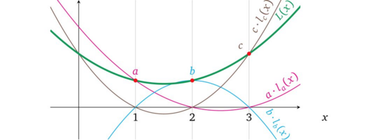
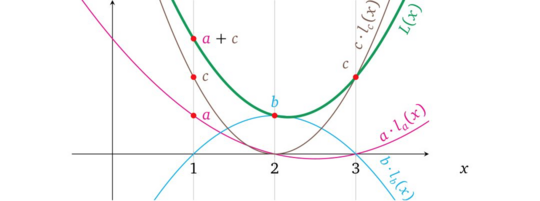
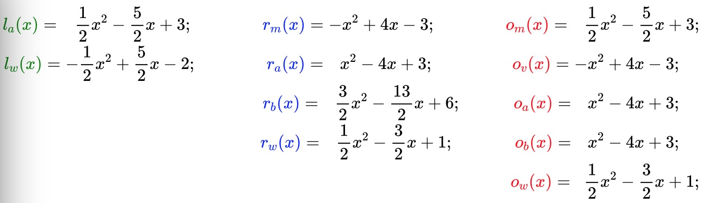
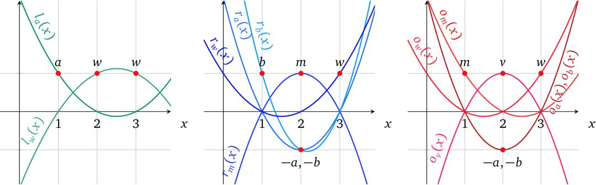
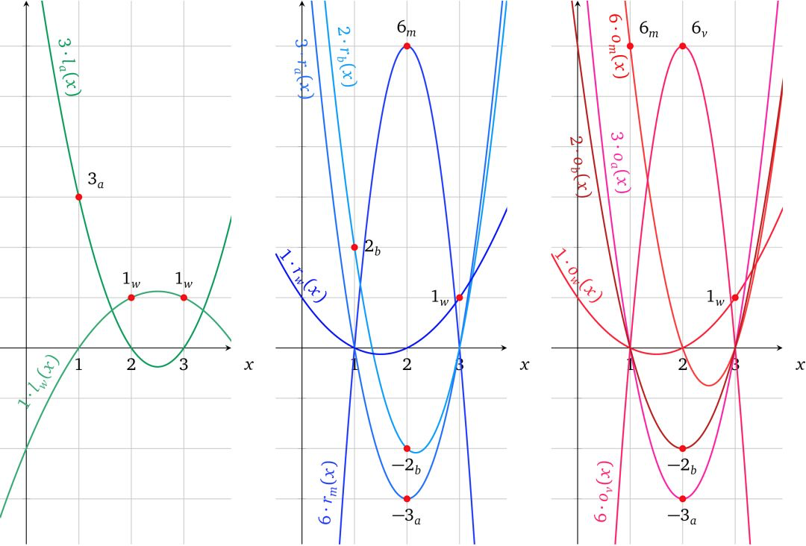
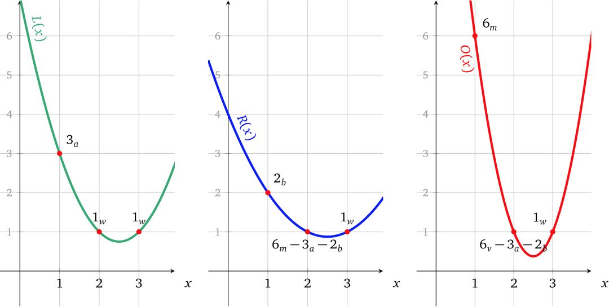
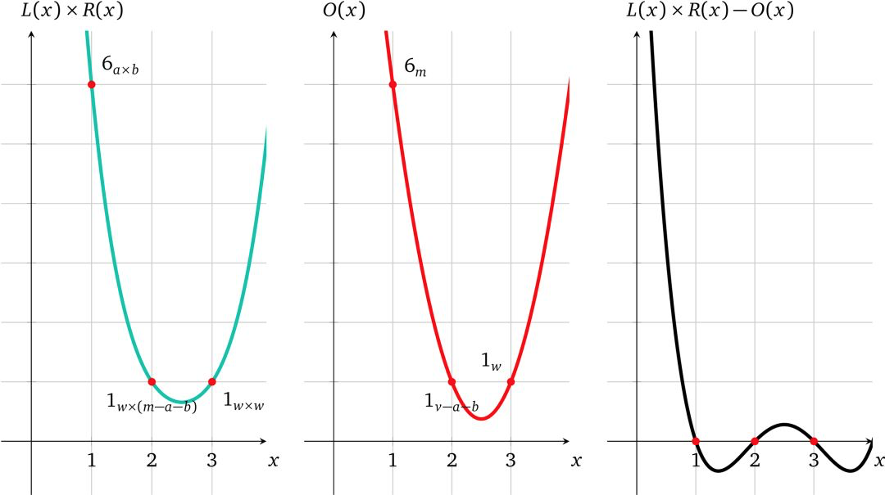

从零开始学习zk-SNARK(四)—多项式的约束

zk-SNARK


上一篇文章中我们学习了如何将程序转换为多项式进行证明。到这里似乎已经有点晕了，本文将对协议执行进一步的约束，并对协议展开优化。 
## 导读


> even@安比实验室: 上一篇文章中我们学习了如何将程序转换为多项式进行证明。到这里似乎已经有点晕了，本文将对协议执行进一步的约束，并对协议展开优化。


【本系列文章】

1. [多项式的性质与证明](https://learnblockchain.cn/article/287)

2. [多项式的非交互式零知识证明](https://learnblockchain.cn/article/329)

3. [从程序到多项式的构造](https://learnblockchain.cn/article/393)

4. [多项式的约束](https://learnblockchain.cn/article/394)

5. [Pinocchio 协议](https://learnblockchain.cn/article/493)


## 结构性质


上文中的修改额外带来了一些其它有用的性质。


### 静态系数


在上文的构造中，我们通过对 未赋值的变量多项式 的计算得到 0 或者 1 ，以此表示在运算中是否要用到这个变量。自然地想，我们也可以使用其它系数值，包括负数值，因为我们可以插值 计算出经过任何必要的点（前提是没有两个计算使用了同一个 x）的多项式。如下是这种运算的一些例子：


<font color=green>$2a$</font> × <font color=blue>$1b$</font> = <font color=red>$3r$</font>

<font color=green>$-3a$</font> × <font color=blue>$1b$</font> = <font color=red>$-2r$</font>


现在我们的程序就可以使用静态系数了，例如：

```

Algorithm 2: Constant coefficients

—————————————————————————————————————————————————————


function calc(w, a, b)

    if w then

        return 3a × b

    else

        return 5a × 2b

    end if

end function

```

在 setup 阶段这些系数类似于 0 或者 1 将被“硬编码”进去，之后就不能再修改了。现在我们将运算形式修改为：


<font color=green>$c_a·a$</font> × <font color=blue>$c_b·b$</font> = <font color=red>$c_r·r$</font>


或者更正式得用参数 $v_n ∈ {v_1, v_2, …, v_n}$ 表示：


<font color=green>$c_l·v_l$</font> × <font color=blue>$c_r·v_r$</font> = <font color=red>$c_o·v_o$</font>


其中下标 l ，r 和 o 表示变量在运算中的位置。

注意：在不同的运算和操作数/输出中，同一个变量的常量系数可以是不同的。


### 没有成本的做加法


看一下这个新结构，很显然在多项式的表示中，每一个不同 x 所要代表的操作数都是所有操作数变量多项式 的总和，其中只有一个被用到的变量是非零值而其它都为 0，下图就很好得表达了这个意思：





我们可以利用这一个结构，加任何数量必要的变量 到每一个运算的操作符/输出中。例如在第一个运算中，我们可以首先做加法 a+c，然后就只需要用别的操作数与之相乘了，即 (a+ c) × b = r，可以表示为下图：





因而也可以将这些变量中任意个，对它们先乘以任意的系数再一并加入到一起作为单个操作数中，以此来根据相应程序的需要构造一个操作数值。这个特性实际上就允许将运算结构改为：


<font color=green>$(c_{1,a} + c_{1,b} + ...)$</font> × <font color=blue>$(c_{r,a} + c_{r,b} + ...)$</font> = <font color=red>$(c_{o,a} + c_{o,b} + ...)$</font>


或者更正式一些用变量 vᵢ ∈ {v₁, v₂, …, vₙ} 和操作数变量系数


$c_{l,i}\in c_{l,1},c_{l,2},...,c_{l,n},$

$c_{r,i}\in c_{r,1},c_{r,2},...,c_{r,n},$

$c_{o,i}\in c_{o,1},c_{o,i},...,c_{o,n},$


这个结构就是：


<font color=green>$\sum_{i=1}^n c_{l,i}\cdot v_i$</font> × <font color=blue>$\sum_{i=1}^n c_{l,i}\cdot v_i$</font> = <font color=red>$\sum_{i=1}^n c_{o,i}\cdot v_i$</font>


注意 ：每一个运算的操作数都有自己的一组系数 c。


> 注解
> even@安比实验室：乘法运算是关键，而加法运算都可以被合并到一个更大的乘法运算里面。


### 加法，减法和除法


到目前为止，我们一直专注于乘法操作。但是为了能够执行通用计算，真实环境下的程序也需要加法，加法和除法。


加法 在前面的章节中，我们已经确定了可以在单个操作数的内容中将变量加起来，然后和另一个操作数相乘，即(3a + b) × d = r ，但是如果我们只是想做加法，没有乘法，例如一个程序中需要做 a + b 的计算，我们可以按照下面的方式来表示：(a+b) × 1 = r


> @Maksym（作者）：因为我们的结构中对于每一个操作数我们既需要常量系数也需要变量 (c ⋅ v) ，1 这个值可以表示为 c₁ ⋅ v₁，其中 c₁ = 1 可以被“硬编码”到对应的多项式中， v₁ 是一个变量可以给它分配任何值，那么我们就必须通过一些约束来限制 v₁ 的值，这个在后面的章节中将会讲到。


减法 减法与加法几乎一致，唯一的不同就是负系数， a-b 也就是：


<font color=green>$(a+ -1·b)$</font> × <font color=blue>$1$</font> = <font color=red>$r$</font>


除法 如果我们检查除法运算


$\frac{factor}{divisor}=result$


可以看到除法的结果是就是我们要得到一个结果值使其乘以 divisor 能够得到 factor。所以我们也可以用乘法来表示出同一个意思：divisor × result = factor。这样就是说如果我们想要去证明除法运算 a / b= r，我们就可以把它表示为：


<font color=green>$b$</font> × <font color=blue>$r$</font> = <font color=red>$a$</font>


> @Maksym（作者）：运算的结构也称为 “约束” ，因为多项式结构代表的运算，并非是为了计算出结果，而是在 prover 已经知晓的变量赋值的情况下，检验这个运算的过程是否正确。换句话说，即约束 prover 必须提供一致的值，无论这些值是什么。

所有的算术计算（加减乘除）都已经有了，于是运算结构不再需要修改。


> 注解
even@安比实验室: 约束和运算有一定的关联性。算术电路的目的是为了实现「计算的验证」，而非「计算的过程」。
上一篇文章中，我们提出了一种方法：把构造多项式的工作交给 setup 环节，prover 只要填上对应的数值就可以了。 这个方法不仅解决了同一个操作数运算符中不一致的问题，同时还带来了额外的便利：
1）允许执行计算的表达式中包含静态系数。
2）虽然 l(x)·r(x)=o(x)的关系中只有乘法，但利用这个方法也可以轻松的执行加法操作，继而也就解决了减法和除法的问题。


## 计算示例


有了一组通用的运算结构，我们就可以将我们原始的程序（上一篇文章中的例子）转换成一组运算，然后再转换成多项式的形式。我们先来想一下算法的数学形式（用变量 v 表示运算结果）：


$w \times (a \times b) + (1-w) \times (a+b)=v$ 


这里有三个乘法，但是由于运算结构只支持一个乘法操作，所以这里至少就要做三次运算。但是，我们可以将它简化为:

$w \times (a \times b) + a+b-w \times (a+b)=v$ 

$w \times (a \times b-a-b)=v-a-b $


现在要包含同样的关系只需要两个乘法。这种运算的完整形式就是：

1:	<font color=green>$1 \cdot a$</font> × <font color=blue>$1\cdot b$</font> = <font color=red>$1 \cdot m$</font>

2:	<font color=green>$1 \cdot w$</font> × <font color=blue>$1\cdot m + -1\cdot a + -1\cdot b$</font> = <font color=red>$1 \cdot v + -1\cdot a + -1 \cdot b$</font>

我们还可以再增加一条约束使 w 必须为二进制数，否则 prover 就可以代入任何值去执行一个错误的运算了：


3:	<font color=green>$1 \cdot w$</font> × <font color=blue>$1\cdot w$</font> = <font color=red>$1 \cdot w$</font>


要了解为什么 w 只能为 0 或者 1，我们可以把等式表示为 w² – w = 0，也就是 (w – 0)(w – 1) = 0 这里 0 和 1 是唯一解。


现在一共有 5 个变量，以及 2 个左操作符， 4 个右操作符和 5 个输出。操作符多项式为：


<font color=green>$L(x)=a \cdot l_a(x)+w \cdot l_w(x)$</font>

<font color=blue>$R(x)=m \cdot r_m(x)+a \cdot r_a(x)+b \cdot r_b(x)$</font>

<font color="red">$O(x)=m \cdot o_m(x)+v \cdot o_v(x)+a \cdot o_a(x)+b \cdot o_b(x)$</font>


在三次运算中必须为每个变量多项式都分别算出一个对应的系数或者如果这个多项式在计算的操作数或者输出中没有被用到的话系数就置为 0。

<font color=green>$ l_a(1)=1; l_a(2)=0; l_a(3)=0$</font>;<font color=blue>$r_m(1)=0;  r_m(2)=1; r_m(3)=0$</font>;<font color="red">$ o_m(1)=1; o_m(2)=0;o_m(3)=0$</font>;


<font color=green>$ l_w(1)=0; l_w(2)= 1; l_w(3)=1$</font>;<font color=blue>$ r_a(1)=0;  r_a(2)=-1;r_a(3)=0$</font>;<font color="red">$ o_v(1)=0; o_v(2)=1; o_v(3)=0$</font>;


$\ \ \ \ \ \ \ \ \ \ \ \ \ \ \ \ \ \ \ \ \ \ \ \ \ \ \ \ \ \ \ \ \ \ \ \ \ \ \ \ \ \ \ \ \ \ \ \ \ \  \ \ \ $<font color=blue>$ r_b(1)=1;  r_b(2)= -1;  r_b(3)=0$</font>;<font color="red">$ o_a(1)=0; o_a(2)= -1;o_a(3)=0$</font>;


$\ \ \ \ \ \ \ \ \ \ \ \ \ \ \ \ \ \ \ \ \ \ \ \ \ \ \ \ \ \ \ \ \ \ \ \ \ \ \ \ \ \ \ \ \ \ \ \ \ \  \ \ \ $<font color=blue>$ r_w(1)=1; r_w(2)=  0; r_w(3)=0$</font>;<font color="red">$ o_b(1)=0;o_b(2)= -1; o_b(3)=0$</font>;


$\ \ \ \ \ \ \ \ \ \ \ \ \ \ \ \ \ \ \ \ \ \ \ \ \ \ \ \ \ \ \ \ \ \ \ \ \ \ \ \ \ \ \ \ \ \ \ \ \ \ \ \ \ \ \ \ \ \ \ \ \ \ \ \ \ \ \ \ \ \ \ \ \ \ \ \ \ \ \ \ \ \ \ \ \ \ \ \ \ \ \ \ \ \ \ \ \ \ \ \ \ \ \ \ \ \ \ \   $<font color="red">$ o_w(1)=0; o_w(2)= 0;o_w(3)=1$</font>;


结果因式多项式就是 t(x) = (x – 1)(x –2)(x –3)，它必须确保这三个运算都能被正确计算。


接下来，我们利用多项式插值法来找到每个变量多项式：





绘制出来就是：





我们准备通过多项式去证明计算，首先，选择函数的输入值，例如：w = 1, a = 3, b= 2。其次，计算过程中的中间变量值为：


m=a × b =6

v = w(m-a-b)+a+b=6


然后，我们把所有计算结果中的值赋值到 变量多项式 中，然后相加得到操作数或者输出多项式的形式：


<font color=green>$ L(x)=e \cdot l_a(x) + 1 \cdot l_w(x)$</font>=$x^2 - 5x +7$


<font color=blue>$ R(x)=6 \cdot r_m(x) + 3 \cdot r_a(x)+2 \cdot r_b(x) + 1 \cdot r_w(x)$</font>=$\frac12 x^2-2\frac12x+4$


<font color="red">$ O(x)=6 \cdot o_m(x) + 6 \cdot o_v(x)+3 \cdot o_a(x) + 2 \cdot o_b(x)+ 1 \cdot o_w(x)$</font>$=2\frac12 x^2-12\frac12x+16$


在图中就表示为：





把他们相加成对应运算中的操作数和输出值：





我们需要去证明 L(x) × R(x) – O(x) = t(x)h(x)，因而我们先找出 h(x)：


$h(x)=\frac{L(x)\times R(x)-O(x)}{t(x)}$

$=\frac{\frac12x^4-5x^3+\frac{35}2x^2-25x+12}{(x-1)(x-2)(x-3)}=\frac12x-2$


以图的形式表示为：





这里很明显多项式 L(x) × R(x) – O(x) 的解为 x= 1， x= 2 和 x= 3，因而 t(x) 是它的因式，假如使用了和它不一致的变量值，情况就不是这样了。


这就是一组能够正确计算的变量值，如何在多项式层面上证明出来的。下面 prover 还要再继续处理协议的密码学部分。


## 可验证计算协议


我们基于前文中多项式知识协议 做了很多重要的修改使它变得更通用，我们再来看一下它现在的定义。假定函数 f(*) 是要证明的问题中的计算结果，其中操作数的数量为 d ，变量的数量 n ，以及它们对应的系数为：

$\left\{c_{L,i,j},c_{R,i,j},c_{O,i,j}\right\}i\in 1,..,d,j\in i,..d$


* **Setup**


- ​				  为左操作数$\left\{l_i(x)\right\}i\in \left\{1,..,n\right\}$  构造变量多项式 然后对于所有$j\in \left\{1,..,d\right\}$  的运算都算出其对应的系数，即$l_i(j)=c_{L,i,j}$ ，对右操作数和输出也做同样的事情。


- ​					随机抽取 s，α


- ​					计算 t(x)= (x-1)(x-2)…(x-d) 及其结果$g^{t(s)}$ 


- ​					计算 proving key：

$(\left\{ g^{s^k} \right\}k \in [d],\left\{ g^{l_i(s)}, g^{r_i(s)}, g^{o_i(s)}, g^{\alpha l_i(s)}, g^{\alpha r_i(s)}, g^{\alpha o_i(s)} \right\} i \in \left\{ 1,..,n \right\})$

 

- ​					  计算 verification key：$(g^{t(s),g^\alpha})$


* **Proving**


   * ​						计算函数 f(*) 以此计算相应的变量 $\left\{ v_i\right\} i \in \left\{ 1,..,n\right\} $


   * ​						计算$h(x)=\frac{L(x)\times R(x)-O(x)}{t(x)}$ ，其中$L(x)=\sum^n_{i=1} v_i\cdot l_i(x),R(x),O(x)$与之相似


   * ​							给变量赋值并对操作数多项式求和：

$g^{L(s)}=(g^{l_1(s)})^{v_1}...(g^{l_n(s)})^{v_n},g^{R(s)}$

$=\prod^n_{i=1}(g^{r_i(s)})^{v_i},g^{O(s)}=\prod^n_{i=1}(g^{o_i(s)})^{v_i}$


   * ​							对变换后的多项式赋值：

$g^{\alpha L(s)}=\prod^n_{i=1}(g^{\alpha l_i(s)})^{v_i},g^{\alpha R(s)}$

$=\prod^n_{i=1}(g^{\alpha r_i(s)})^{v_i},g^{\alpha O(s)}=\prod^n_{i=1}(g\alpha o_i(s))^{v_i}$


   * ​							使用 s 的幂加密值:$\left\{g^{s^k} \right\}k\in[d]$ 计算加密值 $g^{h(s)}$


   * ​							生成证明：$\left\{g^{L(s)},g^{R(s)},g^{O(s)},g^{\alpha L(s)},g^{\alpha R(s)},g^{\alpha O(s)},g^{h(s)} \right\}$


* **Verification**


   * ​								解析证明为 $\left\{g^L,g^R,g^O,g^{L'},g^{R'},g^{O'},g^h \right\}$


   * ​								检查可变多项式约束：$e(g^L,g^\alpha)=e(g^{L'},g),e(g^R,g^\alpha)=e(g^{R'},g),e(g^O,g^\alpha)=e(g^{O'},g)$


   * ​								验证计算有效性：$e(g^L,g^R)=e(g^t,g^h)\cdot e(g^O,g)$


注意：使用符号  ∏ 来表示多个元素连乘，即： $\prod^n_{i=1} v_i=v_1\cdot v_2\cdot ...\cdot v_n$


对于 $i ∈ \{1, …, n\}$ 所有变量多项式 {lᵢ(x), rᵢ(x), oᵢ(x)} 和目标多项式 t(x) 的设置被称为一个二元算术程序 (QAP，在[Gen+12[1]] 中有介绍)。


虽然协议足够健壮，可以进行常规的计算验证，但这里依然还有两个安全考虑需要去解决。


### 操作数和输出的不可交换性


因为在变量多项式约束检查 中的所有操作数上我们使用了同一个 α，所以就没有办法阻止 prover 做下面的欺骗行为：


* 使用其它的操作数中的可变多项式，即 L′(s) = o₁(s) + r₁(s) + r₁(s) + …


* 完全交换 操作数多项式， 也就是把 O(s) 和 L(s) 换成 O(s) × R(s) = L(s)


* 复用相同的操作数多项式，即 L(s) × L(s) = O(s)


可交换性就是指 prover 可以修改计算过程，并有效证明一些其它无关的计算结果。防止这种行为的一个很显然的方式就是在不同的操作数上使用不同的 $α_s$ ，具体协议就可以修改为：


* **Setup**

…

   * 选择随机数$\alpha_l,\alpha_r,\alpha_o$ 来代替 α


   * 计算其对应的“变换” $\left\{ g^{\alpha_ll_i(s)},g^{\alpha_rr_i(s)},g^{\alpha_oo_i(s)} \right\}i\in \left\{ 1...n\right\}$


   * proving key：$(\left\{ g^{s^k}\right\}k\in[d]\left\{ g^{l_i(s)},g^{r_i(s)},g^{o_i(s)},g^{\alpha_ll_i(s)},g^{\alpha_rr_i(s)},g^{\alpha_oo_i(s)}\right\}i\in \left\{ 1...n\right\})$


   * verfication key：$(g^{t(s)},g^{\alpha _l},g^{\alpha _r},g^{\alpha _o})$


* **Proving**

…

   * 为 “变换”的多项式赋值：

$g^{\alpha_lL(s)}=\prod^n_{i=1}(g^{\alpha_ll_i(s)})^{v_i}$,

$g^{\alpha_lR(s)}=\prod^n_{i=1}(g^{\alpha_rr_i(s)})^{v_i}$,

$g^{\alpha_lO(s)}=\prod^n_{i=1}(g^{\alpha_oo_i(s)})^{v_i}$


   * 设置证明：$(g^{L(s)},g^{R(s)},g^{O(s)},g^{\alpha_lL(s)},g^{\alpha_rR(s)},g^{\alpha_oO(s)},g^{h(s)})$


* **Verification**

…

   * 可变多项式约束验证：

$e(g^L,g^{\alpha_l})=e(g^{L'},g),e(g^R,g^{\alpha_r})=e(g^{R'},g),e(g^O,g^{\alpha_o})=e(g^{O'},g)$


这样就不能在一个操作数中使用其它操作数的变量多项式了，因为 prover 没有办法去获知$\alpha_l,\alpha_r,\alpha_o$来满足 $\alpha_s$ 变换关系。


> 注解

> even@安比实验室: 这里通过对 l(x),r(x)和 o(x) 进行分开 KEA 检查，就解决了上篇文章中提出的第二个缺陷问题——由于 prover 生成的证明中只有计算结果，左操作数，右操作数，输出在计算中混用也不会被发现。

>同样下面一节也解决了上篇文章中提出的第三个缺陷问题——由于左操作数，右操作数，输出是分开表示的，互相之间的关系无法进行约束。


### 跨操作数的变量一致性


对于任意的变量 vᵢ，我们都必须将它的值分配 到每个相应操作数中的一个与之对应的变量多项式上，即：

$(g^{l_i(s)})^{v_i},(g^{r_i(s)})^{v_i},(g^{o_i(s)})^{v_i}$ 


因为每一个操作数运算符 的有效性是分开校验的，并不强制要求我们在对应的变量多项式 中使用相同的变量值。这就意味着在左操作数中变量 v₁ 的值可以与右操作数或输出中的变量值 v₁ 不同。


我们可以通过熟悉的限制多项式的方法（也就是限制变量多项式的方法）在操作数之间强制变量值相等。如果我们能够在所有的操作数之间创造一个作为“变换的校验和”的变量多项式，那么就可以限制 prover 使其只能够赋予相同的值。verifier 可以将这些每个变量的多项式加起来，即：

$g^{l_i(s)+r_i(s)+o_i(s)}$ 


然后乘以一个额外的随机数 β，即

$g^{\beta(l_i(s)+r_i(s)+o_i(s))}$ 


提供这些变换后的多项式给 prover，与变量多项式一起给它赋上变量值：

$(g^{l_i(s)})^{v_{L,i}},(g^{r_i(s)})^{v_{R,i}},(g^{o_i(s)})^{v_{O,i}},(g^{\beta(l_i(s)+r_i(s)+o_i(s))})^{v_{\beta,i}}$


然后加密 β 并把 g^β^加到 verification key 中。现在如果所有的 vᵢ 值相同，即,

$v_{L,i}=v_{R,i}=v_{O,i}=v_{\beta,i}$ 其中 $i\in \left\{ 1,...,n\right\}$


等式就满足：

$e(g^{v_{L,i}\cdot l_i(s)} \cdot g^{v_{R,i}\cdot r_i(s)} \cdot g^{v_{O,i}\cdot o_i(s)},g^\beta)$

$=e(g^{v_{\beta ,i \cdot \beta (l_i(s)+r_i(s)+o_i(s))}},g)$


尽管这个一致性校验很有用，但还是存在一定的概率 l(s), r(s), o(s) 中至少有两项要么计算值相同要么一个多项式可以被另一个整除等情况，这就允许 prover 去分解$v_{L,i},v_{R,i},v_{O,i},v_{\beta,i}$  这些值的关系，使得即使有至少两个不相等的值也依然能够保持等式成立，从而使校验无效：

$( v_{L,i}\cdot l_i(s)+v_{R,i}\cdot r_i(s)+v_{O,i}\cdot o_i(s) )\cdot \beta$

$=v_{\beta,i}\cdot \beta \cdot (  l_i(s)+r_i(s)+o_i(s) )$


例如，一个以 l(x) = r(x) 为例的单个运算。我们用 w 来表示这两个值同时 y = o(s)。这个等式看起来就是：

$\beta ( v_Lw+v_Rw+v_Ow )=b_\beta \cdot \beta(w+w+y)$


对于任意的 $v_R$ 和 $v_O$，这种形式可以令 $v_\beta=v_o$， $v_L=2v_o-v_R$，也就变换成：

$\beta ( 2v_ow-v_Rw+v_ow+v_oy )=v_o \cdot \beta ( 2w+y )$


因而这样一个一致性策略是无效的。缓解这种情况的一种方法是对每个操作数都使用不同的 β，确保操作数的变量多项式 中包含无法预测的值。以下就是修改后的协议：


* **Setup**
* … 随机数 $\beta_l,\beta_r,\beta_o$


   * 对变量一致性多项式 进行计算，加密并添加到 proving key 中：

$g^{ \beta_l l_i(s)+\beta_r r_i(s)+\beta_o o_i(s) } i \in \left\{ 1,...,n \right\}$ 


   * 对 $\beta_s$加密并将其加到 verification key 中：$( g^{\beta_l},g^{\beta_r},g^{\beta_o} )$


* **Proving**


   * …将变量值赋给变量一致性多项式：

$g^{z_i(s)}=( g^{ \beta_l l_i(s)+\beta_r r_i(s)+\beta_o o_i(s) } )^{v_i}\ \ for \ \ i \in \left\{ 1,...,n \right\}$


   * 增加分配的多项式到加密空间中:

$g^{Z(s)}=\prod^n_{i=1} g^{z_i(s)} =g^{ \beta_lL(s)+\beta_rR(s)+\beta_oO(s) }$


   * 再在证明中加入：$g^{Z(s)}$


* **Verification**


   * …校验提供的操作数多项式 和 “校验和”多项式之间的一致性：

$e(g^L,g^{\beta_l}) \cdot e(g^R,g^{\beta_r}) \cdot e(g^O,g^{\beta_o}) = e(g^Z,g)$


这相当于：

$e(g,g)^{ \beta_lL+ \beta_rR+ \beta_oO }=e(g,g)^Z$


这个构造中同一个变量值就无法乱用了，因为不同的 βs 使得相同多项式无法兼容，但是这里还存在与 remark 4.1 相同的缺陷，由于$g^{β_l}，g^{β_r}，g^{β_o}$是公开可见的，攻击者可以修改任意变量多项式的零索引系数，因为它并不依赖于 s，即，$g^{β_ls^o}= g^{β_l}$。


> 注解even@安比实验室: 回忆一下，上文中我们提出了在 setup 阶段设置数学表达式的约束关系来解决了一些问题，但这里似乎有引入了一个问题：如果保证 prover 构造的证明是用遵循这些约束关系计算出来的呢？KEA 其实已经解决了这个问题，但似乎并不完美，这就是我们下面要讨论的变量延展性问题。


### 变量非延展性和变量一致性多项式


#### 变量多项式的延展性

举一个 remark 4.1 有关的例子，看一下下面的两个运算：

<font color=green>a</font> × <font color=blue>1</font> = <font color="red">b</font>

<font color=green>3a</font> × <font color=blue>1</font> = <font color="red">c</font>


预期的结果 b = a 和 c = 3a , 再进一步就是  c = 3b。这就是说左操作数的变量 多项式的计算结果为 la(1) = 1 和 la(2) = 3。先不管  la(x) 的形式， prover 都可以不按照上述的比例用另一个修改了的多项式 lₐ′(x) = ala(x) + 1 来给 a 赋值。这样运算就变成了  la′(1) = a+ 1 和 la′(2) = 3a+ 1, 结果也就是 b = a + 1 和 c = 3a + 1，其中 c≠3b，这意味着 a 的取值的实际意义在不同运算中是不一样的。


但是因为 prover 已经拿到了 $g^{α_l}$ 和 $g^{β_l}$ ，所以他依然能够通过正确的操作符多项式和变量值一致性的校验：


* …**Proving**：


   * 用分配不成比例的变量 a 来建立左操作数多项式： $L(x)=a \cdot l_a(x)+1$


   * 按照常规的方式构造右操作数多项式和输出多项式： 

$R(x) = r_1(x),O(x) = b \cdot o_b(x) + c \cdot o_c(x)$


   * 计算除数：$ h(x) = \frac{L(x) \cdot R(x) - O(x)}{t(x)} $ 


   * 计算加密值：$g^{L(s)} = (g^{l_\alpha (s)})^\alpha \cdot g^1$，并按照常规方式计算 $g^{R(s)},g^{O(s)}$


   * 计算 α-变换的加密值：$ g^{\alpha L(s)} = ( g^{ \alpha l_\alpha (s) } )^ \alpha \cdot g^\alpha $ ，并按照常规方式计算 $g^{\alpha R(s)},g^{\alpha O(s)}$


   * 计算变量一致性多项式：$ g^{Z(s)} = \prod_{i \in 1,a,b,c} (g^{ \beta_ll_i(s)+\beta_rr_i(s)+\beta_oo_i(s) })^i \cdot g^{\beta_l} = g^{ \beta_l(L(s)+1)+\beta_rR_i(s)+\beta_oO_i(s) }$ ，其中下标 i 代表对应变量的符号；指数 i 代表变量的值；以及未定义的变量多项式的值为 0。


   * 设置证明： $( g^{L(s)},g^{R(s)},g^{O(s)},g^{\alpha _lL(s)},g^{\alpha _rR(s)},g^{\alpha _oO(s)},g^{Z(s)},g^{h(s)} )$


* **Verification**：


   * 变量多项式约束检查：

$e(g^L,g^{\beta_l}) \cdot  e(g^R,g^{\beta_r}) \cdot e(g^O,g^{\beta_o})$ 

  $=e(g^Z,g) \implies e(g,g)^{ (\alpha \cdot l_\alpha+1)\beta_l + R \beta_r + O \beta_o }$

  $=e(g,g)^{ \beta_l(L+1)+\beta_rR+\beta_oO }$


   * 有效计算检查：$e(g^L,g^R) = e(g^t,g^h) \cdot e(g^O,g)$


#### 变量一致性多项式的延展性


而且 $gβ_l，gβ_r，gβ_o$的存在允许我们在不同操作数的相同变量上使用不同的值。例如，如果我们有一个运算：

$a \times a = b$


可以用多项式表示：

$l_a(x)=x,r_a(x)=x,o_a(x)=0$

$l_b(x)=0,r_b(x)=0,o_b(x)=x$


尽管我们期待的输出是 b= a²，但我们可以设置不同的 a 值，例如：设置 a= 2 （左操作数中）, a= 5（右操作数中）如下：


* **Proving**：


   * …用 a=2 设置左操作数多项式：$L(x)=2l_a(x)+10L_b(x)$


   * 用 a=5 设置右操作数多项式：$R(x)=2r_a(x)+3+10r_b(x)$


   * 用 b=10 设置输出多项式：$O(x)=2o_a(x)+10o_b(x)$


   * …计算加密值：

$ g^{L(s)}=( g^{l_a(s)} )^2 \cdot ( g^{l_b(s)} )^{10} = g^{2l_a(s)+10l_b(s)} $

$ g^{R(s)}=( g^{r_a(s)} )^2 \cdot (g)^3 \cdot ( g^{r_b(s)} )^{10} = g^{2r_a(s)+10r_b(s)} $

$ g^{O(s)}=( g^{O_a(s)} )^2 \cdot ( g^{O_b(s)} )^{10} = g^{2o_a(s)+10o_b(s)} $


   * 计算变量一致性多项式：

$ g^{Z(s)}=( g^{ \beta_ll_a(s)+\beta_rr_a(s)+\beta_oo_a(s) } )^2 \cdot ( g^{\beta_r} )^3 \cdot ( g^{ \beta_ll_b(s)+\beta_rr_b(s)+\beta_oo_b(s) } ) $

$ =g^{ \beta_l( 2l_a(s)+10l_b(s) ) + \beta_r( 2r_a(s)+3+10r_b(s) ) + \beta_o( 2o_a(s)+3+10o_b(s) ) } $


* **Verification**：


   * ……变量值的一致性检查，应满足：

$ e(g^L,g^{\beta_l}) \cdot e(g^R,g^{\beta_r}) \cdot e(g^O,g^{\beta_o}) = e(g^Z,g ) $


注意：多项式 $o_a(x)，l_b(x)，r_b(x)$ 其实可以被忽略掉的，因为这几项对于任何 x 的取值，计算结果都为 0，但是为了保持完整性我们依然要保留这几项。


> 注解
>
> even@安比实验室：这种能力会危害到协议的可靠性。很显然，加密的 βs不应该对 Prover 可见。


#### 非延展性


解决延展性问题的一个方法就是，在 setup 阶段将 verification key 中加密的$ β_s $项与随机秘密值 γ(gamma) 相乘使其与加密值 Z(s) 不兼容：

$ g^{\beta_l \gamma},g^{\beta_r \gamma},g^\beta $


相应的这种被修饰过的加密值，就能阻止使得修改加密值 Z(s) 变得不可行了，因为 Z(s) 中没有 γ，即：

$ g^{Z(s)} \cdot g^{v' \cdot \beta_l r} =g^{ \beta_l( L(s)+v'r ) +\beta_rR(s) + \beta_oO(s) }  $


因为变值 γ 是随机的 prover 并不知道它的值。所以这个修改就需要我们用 Z(s) 乘以 γ 来平衡协议中的变量值一致性校验等式：


* **Setup**：

   

* …随机数 $ β_l，β_r，β_o，γ $


   * …设置 verification key：$( ...,g^{\beta_l \gamma},g^{\beta_r \gamma},g^{\beta_o \gamma},g^\gamma )$


* **Proving**：…


* Verification：


   * …变量值一致性检查应满足：

$ e(g^L,g^{\beta_l\gamma}) \cdot e(g^R,g^{\beta_r\gamma}) \cdot e(g^O,g^{\beta_o\gamma}) =e(g^Z,g^\gamma) $


这里很重要的一点是我们排除了变量多项式为 0-阶的例子（即，l₁(x) = 1x⁰），否则就可以从 proving key 的变量一致性多项式 中揭露出加了密的 β 值

$g^{ \beta_ll_i(s)+\beta_rr_i(s)+\beta_oo_i(s) } i \in \left\{1,...,n  \right\}$


这个例子中当操作数/输出中的任意两项为 0 时，即，对于 l₁(x) = 1, r₁(s) = 0, o₁(s) = 0 的例子，结果就是

$g^{ \beta_ll_1(s)+\beta_rr_1(s)+\beta_oo_1(s) } = g^{\beta_l}$


我们同样也可以通过修饰 $α_s$ 项来解决变量多项式 的延展性问题。但是这就没有必要了，因为对于变量多项式 的任何修改，都需要被映射到变量的一致性多项式 中，而一致性多项式是无法修改的。


### 变量值一致性检查的优化


现在变量值一致性 检查是有效的，但是这里在 verification key 中增加了 4 个昂贵的配对操作和 4 个新的项。文献 [Par+13[2]] 中的 Pinocchio 协议用了一个很聪明的方法优化，通过选择不同的生成元 g ，从而对每个操作数实行“移位”：


* …**Proving**：


   * 用分配不成比例的变量 a 来建立左操作数多项式：$L(x)=a \cdot l_a(x)+1$ 


   * 按照常规的方式构造右操作数多项式和输出多项式： 

$R(x)=r_1(x),O(x)=b \cdot o_b(x) +c \cdot o_c(x)$


   * 计算除数：$ \frac{L(x) \cdot R(x) -O(x)}{t(x)} $


   * 计算加密值：$ g^{L(s)}=( g^{l_a(s)} )^a \cdot g^1 $ ，并按照常规方式计算 $ g^R(s),g^{O(s)} $


   * 计算 α-变换的加密值：$ g^{\alpha L(s)} = ( g^{\alpha l_a(s)} )^a \cdot g^\alpha $ ，并按照常规方式计算 $ g^{\alpha R(s)},g^{\alpha O(s)} $


   * 计算变量一致性多项式：

$ g^{Z(s)} = \prod_{i \in 1,a,b,c} ( g^{ \beta_ll_i(s)+\beta_rr_i(s)+\beta_oo_i(s) }  )^i \cdot g^{\beta_l} $

$= g^{ \beta_l(L(s)+1)+\beta_rR(s)+\beta_oO(s) }$，其中下标 i 代表对应变量的符号；指数 i 代表变量的值；以及未定义的变量多项式的值为 0。


   * 设置证明： $ ( g^{L(s)},g^{R(s)},g^{O(s)},g^{\alpha_lL(s)},g^{\alpha_rR(s)},g^{\alpha_oO(s)},g^{Z(s)},g^{h(s)} ) $


* **Verification**：


   * 变量多项式约束检查：

$ e(g^L,g^{\beta_l}) \cdot e(g^R,g^{\beta_r}) \cdot e(g^O,g^{\beta_o}) = e(g^Z,g) $

 $ \implies e(g,g)^{ (a \cdot l_a +1)\beta_l +R\beta_r+O\beta_o } =  e(g,g)^{ \beta_l(L +1)\beta_l +R\beta_r+O\beta_o }$


   * 有效计算检查：$ e(g^L,g^R)=e(g^t,g^h) \cdot e(g^O,g) $


生成元的这种随机化进一步增加了安全性，使得如 remark 4.1中描述的可变多项式 延展性无效。因为对于故意的修改，它必须要么是$ρ_l, ρ_r$ 或者$ρ_o$ 原始值的倍数要么就是不可直接用的加密值的倍数（假定,如上文所述我们不去处理可能曝光加密后的值的 0 阶可变多项式）。


这个优化使得 verification key 减少了两个项，并且去除了 verification 步骤中的两个配对运算。


注意：在 Jens Groth 2016 年的 paper [Gro16[3]] 中有更进一步的改进。


> 注解
>
> even@安比实验室:至此，通用 zk-SNARK 协议的已经几乎构造完成了，本文可以归纳为以下几点：

> * 协议中是如何增加可变系数的和如何做加减乘除运算的

> * 协议如何保证操作数和输出的不可替代性

> * 协议如何保证跨操作数的可变一致性

> * 协议如何处理非延展性变量和变量一致性

> * 协议中变量值一致性检查优化


原文链接

https://arxiv.org/pdf/1906.07221.pdf


https://medium.com/@imolfar/why-and-how-zk-snark-works-5-variable-polynomials-3b4e06859e30


https://medium.com/@imolfar/why-and-how-zk-snark-works-6-verifiable-computation-protocol-1aa19f95a5cc


参考文献

[Par+13] — Bryan Parno, Craig Gentry, Jon Howell, and Mariana Raykova. Pinocchio: Nearly Practical Verifiable Computation. Cryptology ePrint Archive, Report 2013/279. https://eprint.iacr.org/2013/279. 2013.

[Gen+12] — Rosario Gennaro, Craig Gentry, Bryan Parno, and Mariana Raykova. Quadratic Span Programs and Succinct NIZKs without PCPs. Cryptology ePrint Archive, Report 2012/215. https://eprint.iacr.org/2012/215. 2012.

[Gro16] — Jens Groth. On the Size of Pairing-based Non-interactive Arguments. Cryptology ePrint Archive, Report 2016/260. https://eprint.iacr.org/2016/260. 2016.


原文：https://learnblockchain.cn/article/394

Maksym：https://medium.com/@imolfar
